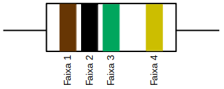
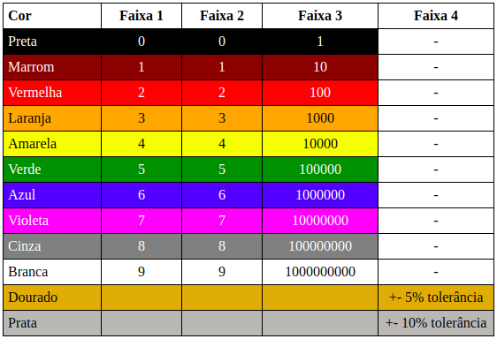

## Sobre
Calcular o valor (Ohms) de um determinado resistor dada as cores das suas faixas.

## Versões
O programa foi escrito nas seguintes linguagens de programação:

* C Ansi
* C++ Ansi
* Javascript
* Java 7
* Python 3
* Bash

## Resistor
O **resistor** é um componente cuja função primária é limitar a passagem da corrente num circuito elétrico/eletrônico. Existem resistores de diversos tamanhos e tipos. O **CTSValorResistor** foi escrito para trabalhar com os resistores de 1/4W com 4 faixas.

## Calculando valor resistor

### Manualmente
Para exemplificar o calculo manual do valor do resistor, vamos tomar como base o resistor abaixo:



Com base na tabela de cores abaixo, o valor da primeira faixa do resistor do nosso exemplo é 1, o valor da segunda faixa é 0 e o valor da terceira faixa é 100000. Para calcular o valor do resistor, deve-se unir os valores da primeira e segunda faixa e multiplicar pelo valor da terceira faixa. Ficando assim: **10 x 100000 = 1000000 = 1M ohms**. Portanto, o valor do resistor é de **1M ohms**.




### Automaticamente
Para as versões em C e C++
```
CTSValorResistor cor-faixa-1 cor-faixa-2 cor-faixa-3
```

Para a versão em Java
```
java -jar CTSValorResistor cor-faixa-1 cor-faixa-2 cor-faixa-3
```

Para a versão em Javascript
```
calcularValorResistor(corFaixa1, corFaixa2, corFaixa3)
```

Para a versão em Python
```
python3 CTSValorResistor.py cor-faixa-1 cor-faixa-2 cor-faixa-3
```

Para a versão em Bash
```
bash CTSValorResistor.sh cor-faixa-1 cor-faixa-2 cor-faixa-3
```

## Licença
Este projeto está sob licença do MIT. Para mais detalhes, ver o arquivo LICENSE.
